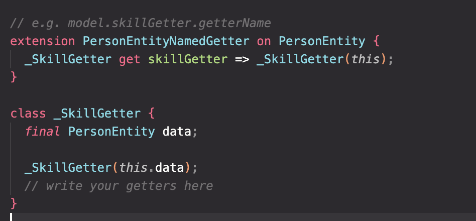
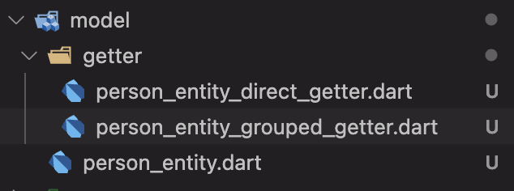

# Dart Getter Generator - VSCode Extension

[VS Code Extension Marketplace](https://marketplace.visualstudio.com/items?itemName=FerdianGunawan.dart-getter)

## Features

The "dart-getter" extension allows you to generate getter methods in Dart classes quickly and easily. Simply select the class you want to generate getters for, choose the type of getter you want to create, and let the extension handle the rest.

When you run Command+Shift + P, there will be 2 options

## Direct Getter

Generate a direct getter extension for the selected Dart class.

## Grouped Getter

Generate getter with the grouped getter. It allows you to have more than
1 getter group.

You need to name the getter
so, the generated file and code will be like this

## The Result
After you select the getter type, the file structure will be like this.
It will be saved on the 'getter' dir in the same parent directory.

## Release Notes

### 0.0.3

Update screenshot and placeholder

### 0.0.2

Update incorrect documentation that may have led to misunderstandings

### 0.0.1

~Initial release of Dart Getter Generation. (Ilmu padi 🌾, Abangku abangku 🔥)
This first version supports creating getter based on 2 ways (Direct and Grouped).
It hasn't supported auto-import by YAML file (Will be developed for the next update)

## Roadmap (Opened issue) - Feel free to contribute
- Add YAML file to configurate the import files as the template every developer
generate the file.
- Auto-merge the grouped getter without destroying the current generated code

## Source

Source code available on [GitHub](https://github.com/ferdiangunawan/dart-getter-vscode-extension).
LinkedIn [Ferdian Gunawan](https://www.linkedin.com/in/ferdiangunawan).

**Enjoy!**
