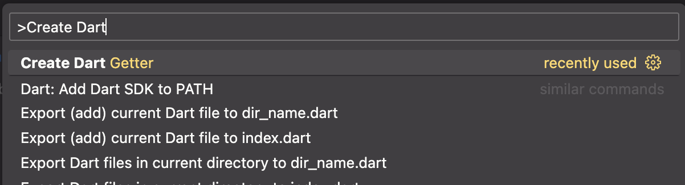
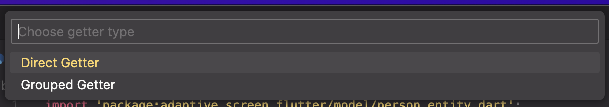
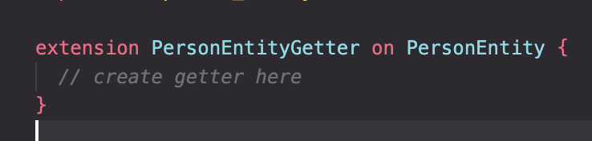

# Dart Getter VSCode Extension

This is the README for the "dart-getter" extension, which provides functionality related to generating Dart getter methods.

## Features

The "dart-getter" extension allows you to generate getter methods in Dart classes quickly and easily. Simply select the class you want to generate getters for, choose the type of getter you want to create, and let the extension handle the rest.

For example if there is an image subfolder under your extension project workspace:

> Tip: Many popular extensions utilize animations. This is an excellent way to show off your extension! We recommend short, focused animations that are easy to follow.

When you run Command+Shift + P, there will be 2 options

## Direct Getter

Generate a direct getter extension for the selected Dart class.

## Grouped Getter

Generate a grouped getter extension with multiple named getter methods for the selected Dart class.

You need to name the getter

## Release Notes

### 0.0.1

~Initial release of Dart Getter Generation.
This first version supports creating getter based on 2 ways (Direct and Grouped).
It hasn't supported auto-import by YAML file (Will be developed for the next update)

## Source

Source code available on [GitHub](https://github.com/ferdiangunawan/dart-getter-vscode-extension).
LinkedIn [Ferdian Gunawan](https://www.linkedin.com/in/ferdiangunawan).

**Enjoy!**
