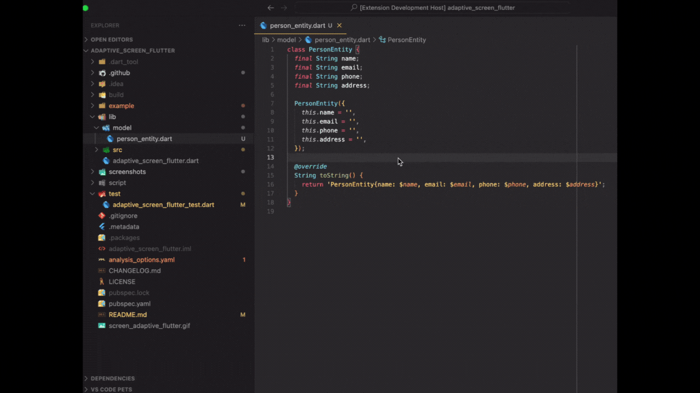
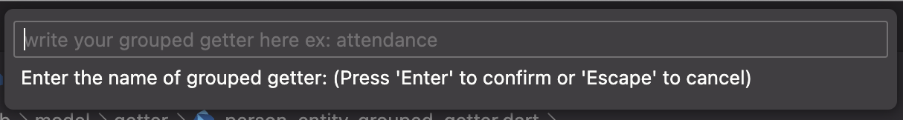

# Dart Getter File Generator - VSCode Extension

[VS Code Extension Marketplace](https://marketplace.visualstudio.com/items?itemName=FerdianGunawan.dart-getter)

## Features

This extension allows you to generate dart getter file quickly and easily. Simply select the class you want to generate getter files for, choose the type of getter you want to create, and let the extension handle the rest.

## Demo

Main Menu

When you run Command+Shift + P, there will be 2 options

## Grouped Getter

Generate getter with the grouped getter. It allows you to have more than
1 getter group.

You need to name the group of getter
so, the generated file and code will be like this

## The generated file structure
After you select the getter type, the file structure will be like this.
It will be saved on the 'getter' dir in the same parent directory.

### 0.0.6
Add "ignore" section to getter_file_template.yaml

### 0.0.5
Remove Direct Getter feature

### 0.0.4

Add new command "Create Getter File Template YAML" to make custom auto import as template when creating getter file.
se Notes

### 0.0.3

Update screenshot and placeholder

### 0.0.2

Update incorrect documentation that may have led to misunderstandings

### 0.0.1

~Initial release of Dart Getter Generation. (Ilmu padi 🌾, Menyala abangku 🔥)
This first version supports creating getter based on 2 ways (Direct and Grouped).
It hasn't supported auto-import by YAML file (Will be developed for the next update)

## Roadmap (Opened issue) - Feel free to contribute
- Auto-merge the grouped getter without destroying the current generated code

## Source

Source code available on [GitHub](https://github.com/ferdiangunawan/dart-getter-vscode-extension).
LinkedIn [Ferdian Gunawan](https://www.linkedin.com/in/ferdiangunawan).

**Enjoy!**
